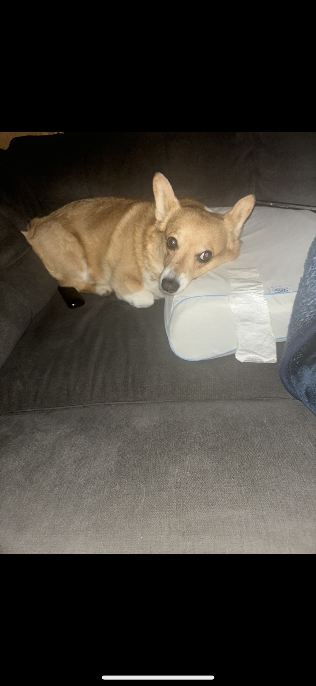

# In-Class-Animal-Activity
Repository for CMPT 276 In-Class Activity to get experience using Git

This is the README file for our In-Class Activity on Git and Github

In this file, I have included a picture of my favourite animal, my pet dog, Kobe

